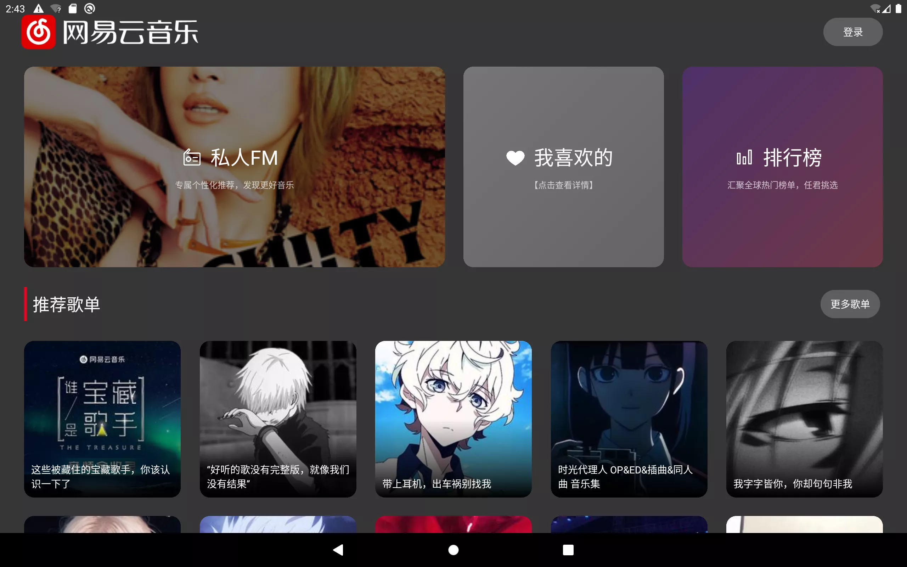
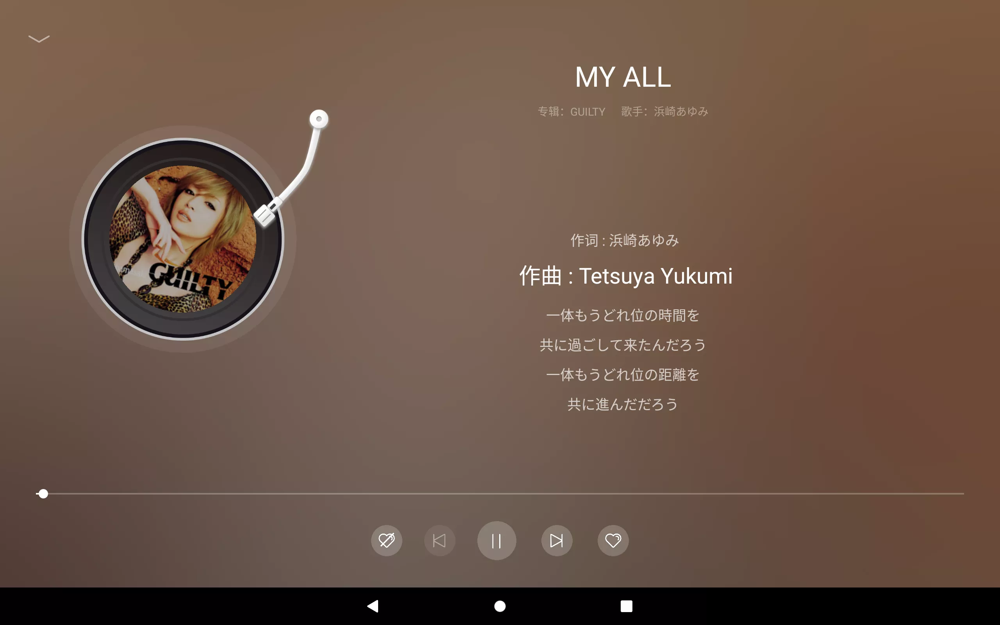
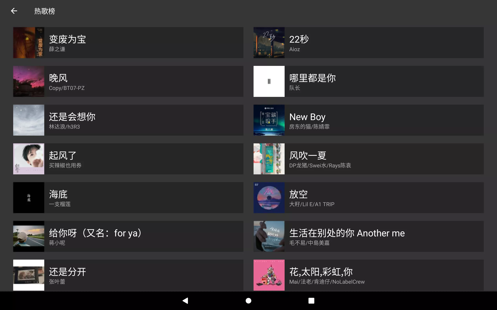

# 网易云 TV 版本

基于 React Native 开发的（仿）网易云音乐（大屏 TV 版本）。

## 预览

&nbsp;&nbsp;&nbsp;&nbsp;

## TODO

- [x] 登录/登出
- [x] 私人 FM
- [x] 推荐歌单
- [x] 排行榜
- [x] 我的喜欢/收藏的歌单
- [x] 热门歌单
- [x] 喜欢/不喜欢歌曲
- [x] 单曲/随机/列表循环
- [x] 歌词
- [x] 收藏/取消收藏歌单
- [ ] 热门电台/电台播放
- [ ] 我的专辑
- [ ] 我的订阅电台

## 运行项目

1. 请自行部署[接口服务端](https://github.com/rojer95/NeteaseCloudMusicApi)
2. 克隆项目 `git clone https://github.com/rojer95/netease-cloud-music-tv-rn.git`
3. 安装依赖 `cd netease-cloud-music-tv-rn && yarn install`
4. 运行 `yarn android`

## 使用的第三方库

- @rojer/react-native-lrc （LRC 歌词）
- react-native-image-sequence （帧动画）
- react-native-linear-gradient （渐变色）
- react-native-navigation （导航解决方案）
- react-native-qrcode-svg （二维码生成）
- react-native-svg （二维码依赖 SVG）
- react-native-track-player （音乐播放）

## Android TV 支持情况

- 为了能够在智能电视（Android）上获取焦点，对 React Native 的`TouchableOpacity`进行封装，主要处理`onFocus`与`onBlur`事件，给可点击组建加上阴影与边框
- 本项目未适配苹果的`tvOS`，请勿在`tvOS`中使用

## 声明

- 本项目仅用于学习，请勿用于任何非法或商业用途，谢谢！
- 未进行大量测试，可能存在 BUG

## 关于 API 端

Fork 自 [Binaryify](https://github.com/Binaryify/NeteaseCloudMusicApi) 的 API，添加了歌曲动态的 URL 获取方法【[点击这里查看](https://github.com/rojer95/NeteaseCloudMusicApi) 】
